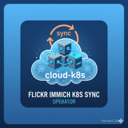
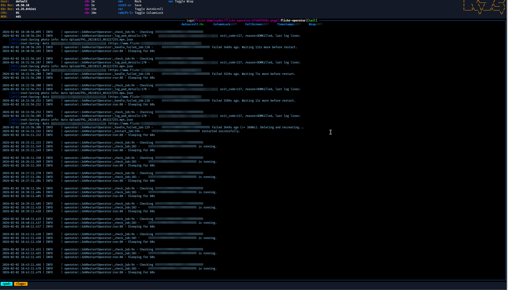

# flickr-immich-k8s-sync-operator

[](https://github.com/vroomfondel/flickr-immich-k8s-sync-operator/actions/workflows/checkblack.yml)
[](https://github.com/vroomfondel/flickr-immich-k8s-sync-operator/actions/workflows/mypynpytests.yml)

[](https://hub.docker.com/r/xomoxcc/flickr-immich-k8s-sync-operator/tags)
[](https://pepy.tech/projects/flickr-immich-k8s-sync-operator)

[](https://hub.docker.com/r/xomoxcc/flickr-immich-k8s-sync-operator)

Kubernetes operator that watches per-user Flickr download Jobs in a namespace,
restarts failed Jobs after a configurable delay, and retrieves pod logs and exit
codes for failed Jobs before restarting them. Designed to run alongside
[Immich](https://immich.app/) (self-hosted photo management).

### Operator in Action



*The operator monitoring Flickr download Jobs in [k9s](https://k9scli.io/), detecting failures, and scheduling restarts.*

## Status

**Beta (v0.0.4)** — the core job-restart loop is stable and actively deployed.
OOMKilled-aware restart logic, structured startup/configuration logging, and
full CI (black + mypy + pytest) are in place.

## Architecture

- Runs as a single-replica **Deployment** in a dedicated namespace (default: `flickr-downloader`)
- Uses the **Kubernetes Python client** with in-cluster config
- Periodically checks configured Job names for failure conditions
- On failure (after a configurable delay), **deletes** the Job with `Foreground` propagation policy and **recreates** it from a cached manifest
- Logs pod exit codes and tail logs before every restart

### How it works

1. An Ansible playbook ([`kubectlstuff_flickr_downloader.yml`](https://github.com/vroomfondel/somestuff/blob/main/flickrdownloaderstuff/kubectlstuff_flickr_downloader.yml)) creates per-user Flickr download Jobs in the `flickr-downloader` namespace
2. Each Job runs [`flickr_download`](https://github.com/beaufour/flickr-download) with `BACKOFF_EXIT_ON_429=true`, so it exits immediately on HTTP 429 rate-limit errors instead of sleeping
3. Jobs mount host directories for config, backup, and cache per user
4. This operator watches all configured Jobs for failure conditions
5. When a Job fails, the operator logs pod exit codes and tail logs, waits `RESTART_DELAY` seconds (default 1 hour), then deletes and recreates the Job from a cached manifest
6. The operator uses namespace-scoped RBAC with minimal permissions (Jobs, Pods, Pod logs)

## Prerequisites

- A running Kubernetes cluster
- Per-user Flickr download Jobs already deployed (e.g. via the Ansible playbook above) — the operator manages their lifecycle (restart on failure), not initial creation
- An [Immich](https://immich.app/) instance (for planned sync functionality)

## Configuration

| Variable | Description | Default |
|---|---|---|
| `LOGURU_LEVEL` | Log verbosity (`DEBUG`, `INFO`, `WARNING`, …) | `DEBUG` |
| `NAMESPACE` | Namespace to watch | `flickr-downloader` |
| `JOB_NAMES` | Comma-separated Job names to monitor (**required**) | — |
| `CHECK_INTERVAL` | Seconds between check cycles | `60` |
| `RESTART_DELAY` | Seconds to wait after failure before restart | `3600` |
| `SKIP_DELAY_ON_OOM` | Skip restart delay when failure reason is `OOMKilled` | `false` |

## Kubernetes Deployment

### RBAC

The operator requires a ServiceAccount with a Role scoped to the target namespace:

```yaml
apiVersion: v1
kind: ServiceAccount
metadata:
  name: flickr-operator
  namespace: flickr-downloader
---
apiVersion: rbac.authorization.k8s.io/v1
kind: Role
metadata:
  name: flickr-operator
  namespace: flickr-downloader
rules:
  - apiGroups: ["batch"]
    resources: ["jobs"]
    verbs: ["get", "list", "create", "delete"]
  - apiGroups: [""]
    resources: ["pods"]
    verbs: ["get", "list", "delete"]
  - apiGroups: [""]
    resources: ["pods/log"]
    verbs: ["get"]
---
apiVersion: rbac.authorization.k8s.io/v1
kind: RoleBinding
metadata:
  name: flickr-operator
  namespace: flickr-downloader
roleRef:
  apiGroup: rbac.authorization.k8s.io
  kind: Role
  name: flickr-operator
subjects:
  - kind: ServiceAccount
    name: flickr-operator
    namespace: flickr-downloader
```

### Deployment

```yaml
apiVersion: apps/v1
kind: Deployment
metadata:
  name: flickr-operator
  namespace: flickr-downloader
spec:
  replicas: 1
  selector:
    matchLabels:
      app: flickr-operator
  template:
    metadata:
      labels:
        app: flickr-operator
    spec:
      serviceAccountName: flickr-operator
      containers:
        - name: operator
          image: xomoxcc/flickr-immich-k8s-sync-operator:latest
          env:
            - name: JOB_NAMES
              value: "flickr-downloader-alice,flickr-downloader-bob"
            - name: LOGURU_LEVEL
              value: "DEBUG"
            # - name: NAMESPACE
            #   value: "flickr-downloader"      # default
            # - name: CHECK_INTERVAL
            #   value: "60"                      # default
            # - name: RESTART_DELAY
            #   value: "3600"                    # default
            # - name: SKIP_DELAY_ON_OOM
            #   value: "false"                   # default
          resources:
            requests:
              cpu: 50m
              memory: 64Mi
            limits:
              cpu: 1500m
              memory: 128Mi
```

## Installation

### From PyPI

```bash
pip install flickr-immich-k8s-sync-operator
```

### From source

```bash
git clone https://github.com/vroomfondel/flickr-immich-k8s-sync-operator.git
cd flickr-immich-k8s-sync-operator
make venv
source .venv/bin/activate
pip install .
```

### Docker

```bash
docker build -t flickr-immich-k8s-sync-operator .
docker run --rm flickr-immich-k8s-sync-operator
```

Or via Makefile:

```bash
make docker
```

## Usage

```bash
# Run directly
flickr-immich-k8s-sync-operator

# Or via Python module
python -m flickr_immich_k8s_sync_operator
```

## Development

### Makefile targets

| Target          | Description                                  |
|-----------------|----------------------------------------------|
| `make venv`     | Create virtualenv and install all dependencies |
| `make tests`    | Run pytest                                   |
| `make lint`     | Format code with black (line length 120)     |
| `make isort`    | Sort imports with isort                      |
| `make tcheck`   | Static type checking with mypy               |
| `make commit-checks` | Run pre-commit hooks on all files      |
| `make prepare`  | Run tests + commit-checks                    |
| `make pypibuild`| Build sdist + wheel with hatch               |
| `make pypipush` | Publish to PyPI with hatch                   |
| `make docker`   | Build Docker image                           |

## License

[GNU Lesser General Public License v3](LICENSE.md)
